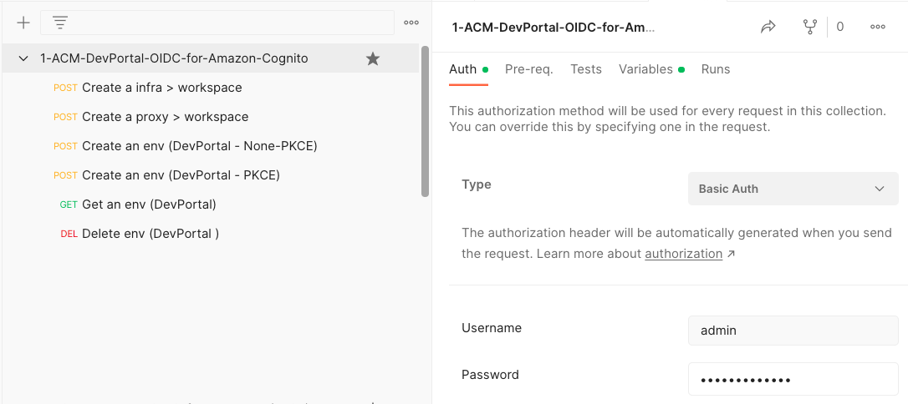
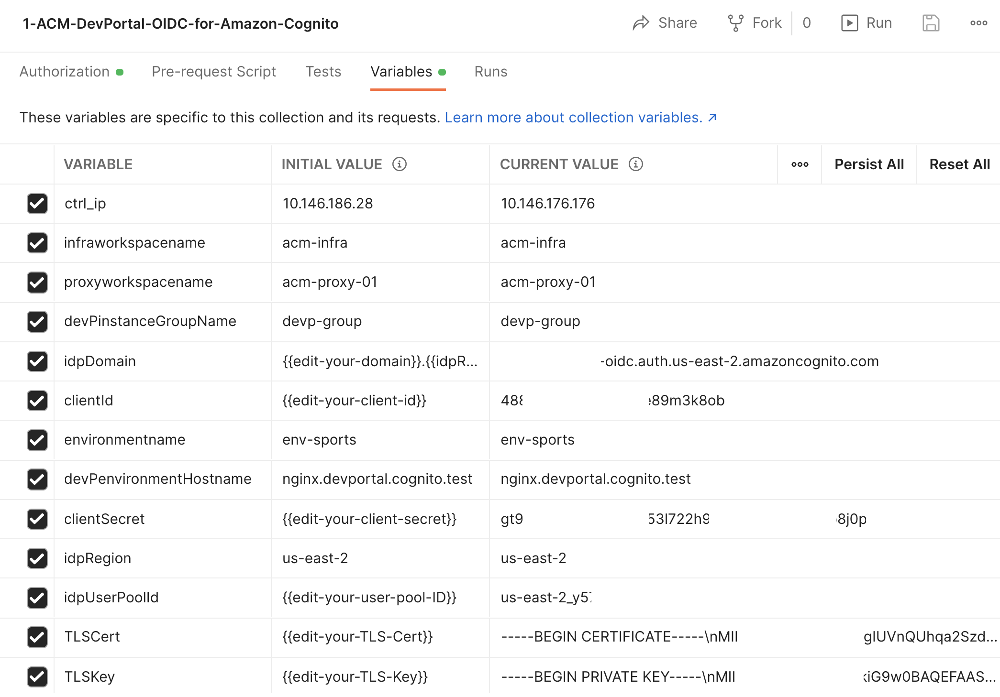
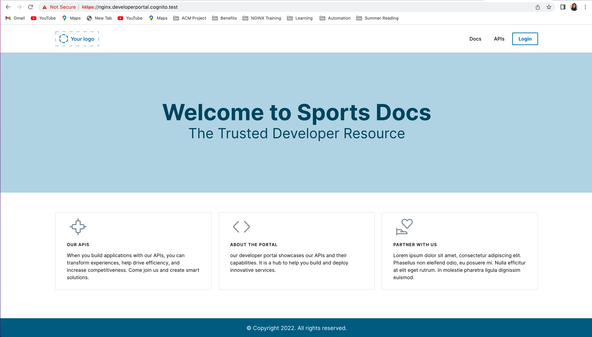
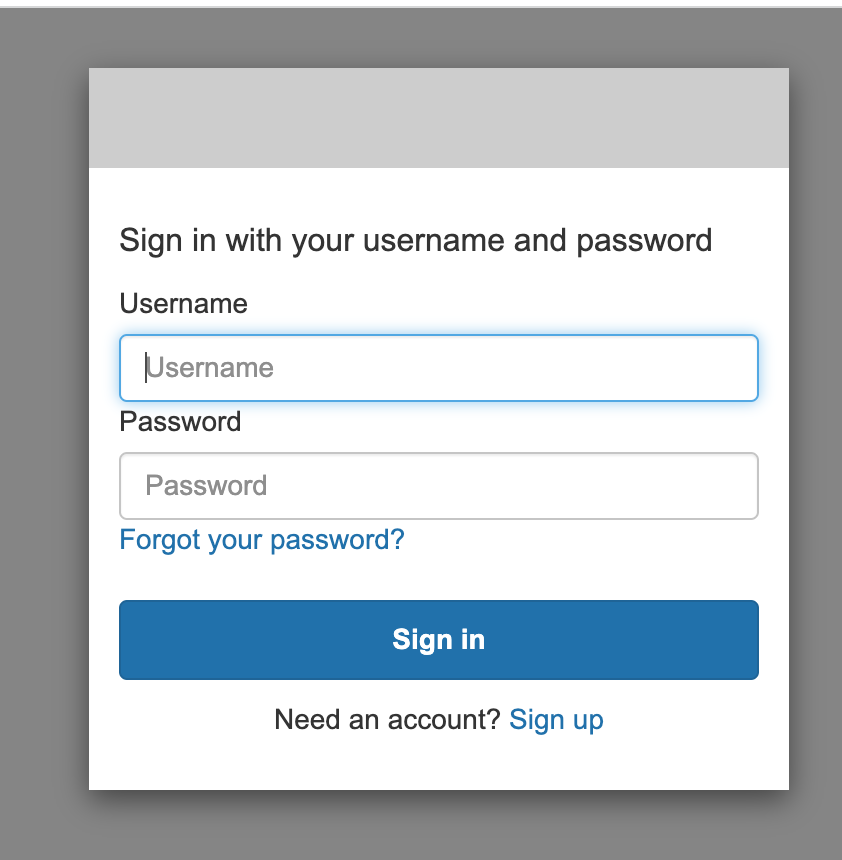
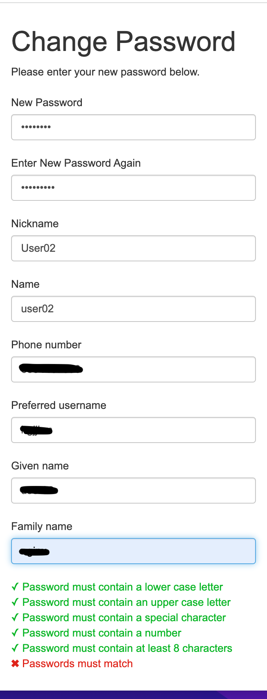

# How To Set Up NGINX ACM/DevPortal OIDC for Amazon Cognito Integration

Take the following steps to set up NGINX ACM/DevPortal OIDC and test it for Amazon Cognito integration.

## 1. Prerequisites

- [**Set up Amazon Cognito**](./01-IdP-Setup.md)

  Ensure that you use **different application and callback/logout URLs** as the following example unlike that are already created to test your [containerized NGINX Plus](./02-NGINX-Plus-Setup.md).

  | Category              | Example                                         |
  | --------------------- | ----------------------------------------------- |
  | Application Name      | `nginx-devportal-app`                           |
  | Allowed Callback URLs | `https://nginx.devportal.cognito.test/_codexch` |
  | Allowed Logout URLs   | `https://nginx.devportal.cognito.test/_logout`  |

- Edit `hosts` file in your laptop via if you want to locally test your app:

  ```bash
  $ sudo vi /etc/hosts
  127.0.0.1 nginx.devportal.cognito.test #Note : The provided IP address should be of the host where you installed the Dev Portal packages .
  # Also make sure your controller and Dev Portal /etc/hosts files have similar entries
  ```

## 2. Install NGINX API Connectivity Manager

- [Download NGINX Management Suite](https://docs.nginx.com/nginx-management-suite/)

- [Install NGINX API Connectivity Manager](https://docs.nginx.com/nginx-management-suite/admin-guides/installation/install-guide/)

## 3. Set Up NGINX Dev Portal

Configure a Dev Portal by either referencing **NGINX Management Suite Docs** of [How To Set Up a NGINX Dev Portal](https://docs.nginx.com/nginx-management-suite/acm/getting-started/add-devportal/) or taking the following steps of calling APIs:

> **Note**:
>
> [Download an example of postman collection](./ACM-DevPortal-OIDC-for-Amazon-Cognito.postman_collection.json) for easily testing the following steps.

- Open a Postman collection, and edit ACM password and variables:
  
  

- Create a `infra > workspace`:

  > `POST https://{{ctrl_ip}}/api/acm/v1/infrastructure/workspaces`
  >
  > `Body`:
  >
  > ```json
  > {
  >   "name": "{{infraworkspacename}}"
  > }
  > ```

- Create a `proxy > workspace`:

  > `POST https://{{ctrl_ip}}/api/acm/v1/services/workspaces`
  >
  > `Body`:
  >
  > ```json
  > {
  >   "name": "{{proxyworkspacename}}"
  > }
  > ```

- Create an environment of `Dev Portal`:

  > `POST https://{{ctrl_ip}}/api/acm/v1/infrastructure/workspaces/{{infraworkspacename}}/environments`

  **Option 1. Request Body for None PKCE**:

  ```json
  {
    "name": "{{environmentname}}",
    "functions": ["DEVPORTAL"],
    "proxies": [
      {
        "proxyClusterName": "{{devPinstanceGroupName}}",
        "hostnames": ["{{devPenvironmentHostname}}"],
        "runtime": "PORTAL-PROXY",
        "policies": {
          "oidc-authz": [
            {
              "action": {
                "authFlowType": "AUTHCODE",
                "jwksURI": "https://cognito-idp.{{idpRegion}}.amazonaws.com/{{idpUserPoolId}}/.well-known/jwks.json",
                "tokenEndpoint": "https://{{idpDomain}}/oauth2/token",
                "userInfoEndpoint": "https://{{idpDomain}}/oauth2/userInfo",
                "authorizationEndpoint": "https://{{idpDomain}}/oauth2/authorize",
                "logOffEndpoint": "https://{{idpDomain}}/logout",
                "logOutParams": [
                  {
                    "paramType": "QUERY",
                    "key": "logout_uri",
                    "value": "https://{{devPenvironmentHostname}}/_logout"
                  },
                  {
                    "key": "client_id",
                    "paramType": "QUERY",
                    "value": "{{clientId}}"
                  }
                ],
                "TokenParams": [
                  {
                    "paramType": "HEADER",
                    "key": "Accept-Encoding",
                    "value": "gzip"
                  }
                ],
                "uris": {
                  "loginURI": "/login",
                  "logoutURI": "/logout",
                  "redirectURI": "/_codexch",
                  "userInfoURI": "/userinfo"
                }
              },
              "data": [
                {
                  "clientID": "{{clientId}}",
                  "clientSecret": "{{clientSecret}}",
                  "scopes": "openid+profile+email"
                }
              ]
            }
          ],
          "tls-inbound": [
            {
              "data": {
                "serverCerts": [
                  {
                    "key": "{{TLSKey}}",
                    "cert": "{{TLSCert}}"
                  }
                ]
              }
            }
          ]
        }
      }
    ]
  }
  ```

  **Option 2. Request Body for PKCE**:

  > ```json
  > {
  >        :
  >   "authFlowType": "PKCE",
  >        :
  >   "clientSecret": "{{clientSecret}}", -> Remove this line.
  >        :
  > }
  > ```

- Get an environment of `Dev Portal`:

  > `GET https://{{ctrl_ip}}/api/acm/v1/infrastructure/workspaces/{{infraworkspacename}}/environments`
  >
  > `Response`:
  >
  > ```
  > {
  >     :
  >     curl -k https://<CTRL-FQDN>/install/nginx-agent > install.sh && sudo sh install.sh -g devp-group && sudo systemctl start nginx-agent
  >     :
  > }
  > ```

- SSH into the instance of Dev Portal, and run the following commands:

  ```ssh
  curl -k https://<CTRL-FQDN>/install/nginx-agent > install.sh && sudo sh install.sh -g devp-group && sudo systemctl start nginx-agent
  ```

## 3. Test Dev Portal OIDC with Amazon Cognito

- Open a web browser and access the Dev Portal's FQDN like `http://nginx.devportal.cognito.test`.
  

- **Login** to click `Sign in` button:

  Enter your name and password which are registered in Amazon Cognito.

  

  When you login first time you will be prompted to update your password which you can update by entering below fields and clicking 'Send' button.

  

- Try `Login` and `Logout`.
- Test the above TWO steps after changing IdP (PKCE option) and updating Dev Portal via NGINX ACM API.
